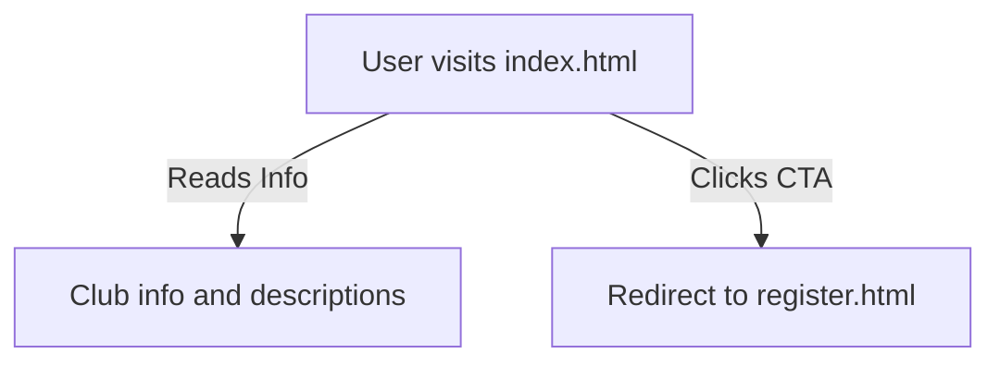

# KPRIET Club Houses Portal (`index.html`)

This page is the welcoming homepage for the KPRIET Club Houses portal. It introduces users to the two main club houses at KPRIET, their respective clubs, and guides students to the club matching and registration flow.

---

## Main Features

- **Clean, modern UI** with a focus on accessibility and responsive design.
- **Two main club houses** showcased: Sangamam (Cultural) and Ignitrron (Technical).
- **Visual elements**: campus and logo images, color-coded sections, and card layouts for clubs.
- **Actionable CTA**: “Find My Perfect Club” button leads to the registration/matching portal.

---

## Page Structure

| Section           | Description                                                                      |
|-------------------|----------------------------------------------------------------------------------|
| Header            | Displays KPRIET logo and a border-accented bar                                   |
| Hero              | Large campus image and a short intro about KPRIET                                |
| Club Houses Table | Two-column table, each cell highlights a club house and its affiliated clubs     |
| CTA Button        | Prominent call-to-action to “Find My Perfect Club” (links to registration page)  |
| Footer            | Copyright info                                                                   |

---

## Club Houses Overview

| House       | Clubs                                                                                                                     | Focus                                |
|-------------|--------------------------------------------------------------------------------------------------------------------------|--------------------------------------|
| Sangamam    | Dance, Music, Photography, Film, Eco, Rotaract, Tamil Mandram, Drama, Youth Parliament                                   | Culture, arts, and social impact     |
| Ignitrron   | Software Dev, AR/VR, Game Dev, Astro, Science, Quiz, Business, Electronics, Robotics                                     | Technology and engineering skills    |

---

## Code Highlights

- **CSS**: Uses CSS variables for theme colors and responsive layouts.
- **No JavaScript**: Purely static, navigation is via `<a href="register.html">`.
- **Table layout**: Ensures both houses are equally presented.

---

## User Flow



---

## Sample Club House Table Markup

```html
<table class="house-table">
  <tr>
    <td class="house-cell">
      
      <h2>Sangamam</h2>
      <h3>Cultural club house of KPRIET</h3>
      <p class="house-desc">Focuses on cultural heritage, artistic expression, and social responsibility. It is the creative heartbeat of our campus life.</p>
      <div class="club-list-box">
        <strong>Clubs under Sangamam:</strong>
        <ul>
          <li>Dance Club & Music Club</li>
          ...
        </ul>
      </div>
    </td>
    <!-- Ignitrron cell similar -->
  </tr>
</table>
```

---

```card
{
    "title": "No backend here",
    "content": "This page is static and only links to the registration portal."
}
```

---

# KPRIET Club Smart Portal (`register.html`)

The registration page is an interactive portal for students to discover or join KPRIET clubs. It offers a modern, app-like experience with quiz-based club matching and direct club selection.

---

## Main Features 🚀

- **Theme toggle**: Switch between dark and light modes.
- **Progress bar**: Tracks scroll progress.
- **Step-by-step flow**: Multi-stage user journey—info input, club finding quiz, results, and registration confirmation.
- **Smart quiz**: Suggests a club based on personality/interest responses.
- **Direct club selection**: For students who already know their preferred club(s).
- **Visual feedback**: Animations, chips, and feedback on selections.

---

## User Experience Flow

```mermaid
flowchart TD
    Start[User visits register.html]
    Start --> Form[Fill personal details]
    Form --> Choice{Choose option}
    Choice -->|Smart Quiz| Quiz[Answer quiz questions]
    Quiz --> QuizResult[See matched club]
    QuizResult --> Confirm[Confirm registration]
    Confirm --> Success[Success message]
    Choice -->|Direct selection| DirectSelect[Choose club(s)]
    DirectSelect --> Confirm


```

---

## Step Breakdown

- **1. Student Info**: Name, email, department, and year.
- **2. Club Discovery Choice**:
    - *Find My Club*: Enters smart quiz flow.
    - *Already Know*: Directly selects clubs from categorized lists.
- **3. Quiz (if chosen)**: 3 questions, multiple choice, each mapped to "tech", "creative", "speaking", "leadership".
- **4. Club Suggestion**: Highest-matching category determines club suggestion.
- **5. Registration**: User confirms details and completes registration.
- **6. Success Screen**: Confirmation with selected club(s) listed.

---

## Core JavaScript Logic

- **State management**: All user progress and selections are stored in a `state` object inside the `ClubPortal` class.
- **Theme persistence**: Last used theme is saved to `localStorage`.
- **Quiz algorithm**: Tallies answer keys, picks the highest, and maps to a recommended club.
- **Form validation**: Ensures required fields and at least one club is selected when using direct mode.
- **DOM manipulation**: Dynamically updates sections; shows/hides as user progresses.
- **No server calls**: All logic is client-side, with no API/endpoint calls.

---

## Sample Quiz Logic

```js
calculateResult() {
  // Counts answer keys, picks the most frequent
  const flatResults = this.state.quizAnswers.flat();
  const counts = {};
  flatResults.forEach(key => counts[key] = (counts[key] || 0) + 1);
  const winner = Object.keys(counts).reduce((a, b) => counts[a] > counts[b] ? a : b);
  // Map to club suggestion and show to user
}
```

---

## Theme Toggle Example

```js
applyTheme() {
  document.documentElement.setAttribute("data-theme", this.state.theme);
  localStorage.setItem("theme", this.state.theme);
  document.getElementById("themeIcon").textContent = this.state.theme === "dark" ? "🌙" : "☀️";
}
```

---

## Key UI Sections

| Section           | Purpose                                                     |
|-------------------|------------------------------------------------------------|
| step-student      | User input + club discovery/selection choice               |
| step-quiz         | Smart quiz step                                            |
| step-result       | Club match result & reasoning                              |
| step-register     | Confirm details, finalize registration                     |
| step-success      | Success message, club chips, and home button               |

---

## Club Suggestion Mapping

| Quiz Key    | Suggested Club            | Reason                                   |
|-------------|--------------------------|------------------------------------------|
| tech        | Software Development Club | "Innovation matches your tech-driven logic."      |
| creative    | Graffio Club              | "Your artistic flair is a perfect fit..." |
| speaking    | Sweet Talkerz             | "Your voice deserves the stage..."        |
| leadership  | Rotaract Club             | "Your leadership can drive real change."  |

---

## Accessibility & UX Notes

- **Keyboard navigation**: All form fields are keyboard-accessible.
- **Responsive**: Mobile-friendly layout.
- **Visual cues**: Cards highlight on selection, chips for club choices, progress bar on quiz.

---

```card
{
    "title": "Client-side only",
    "content": "All data is processed in the browser – no backend, no API, no user data storage."
}
```

---

## No API Endpoints

There are **no API endpoints** or backend controllers in either file. All functionality is purely front-end and handled in-browser.

---

# Final Notes 📝

- Both files together provide a seamless, modern club discovery and registration journey for KPRIET students.
- All logic and user interaction is handled in-browser, with no server communication.
- Easy to customize: Add more clubs, questions, or logic as needed for your institution!
